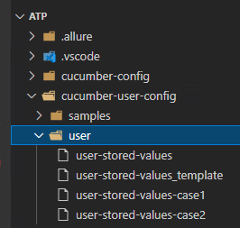

# Script-01 - The principle is to execute a set of scripts twice. 

## Two user-stored-values for case 1 and case 2



### Case 1

File user-stored-values-case1 

````

USV_OrderSite=FR011
USV_OrderSupplier=FR061
USV_SiteRcp=FR011

````

### Case 2

File user-stored-values-case2 

````

USV_OrderSite=FR011
USV_OrderSupplier=FR059
USV_SiteRcp=FR012

````

## Execution for the case 1

Command

````bash
# parameter userStoredValuesFile=cucumber-user-config/user/user-stored-values-case1
$ userStoredValuesFile=cucumber-user-config/user/user-stored-values-case1 npm run cloud-chrome

````

Execution

````
> @sageatp/x3-atppackage@2.6.0 cloud-chrome D:\Sage\SafeX3\Atp
> wdio ./cucumber-config/cloud.js

CONFIG READ FOR CLOUD
MAX_INSTANCES: 1

Execution of 2 spec files started at 2022-05-12T16:49:09.533Z

Features path: D:\Sage\SafeX3\Atp/Workspace/demo-purchase/*.feature
Cucumber tags:
Feature to run:
D:/Sage/SafeX3/Atp/Workspace/demo-purchase/10-10-purchase-order.feature
D:/Sage/SafeX3/Atp/Workspace/demo-purchase/10-20-purchase-receipt.feature
[0-0] CONFIG READ FOR CLOUD
[0-0] MAX_INSTANCES: 1
[0-0] RUNNING in chrome - D:\Sage\SafeX3\Atp\Workspace\demo-purchase\10-10-purchase-order.feature
...

````

## Execution for the case 2

Command

````bash
# parameter userStoredValuesFile=cucumber-user-config/user/user-stored-values-case2
$ userStoredValuesFile=cucumber-user-config/user/user-stored-values-case2 npm run cloud-chrome
